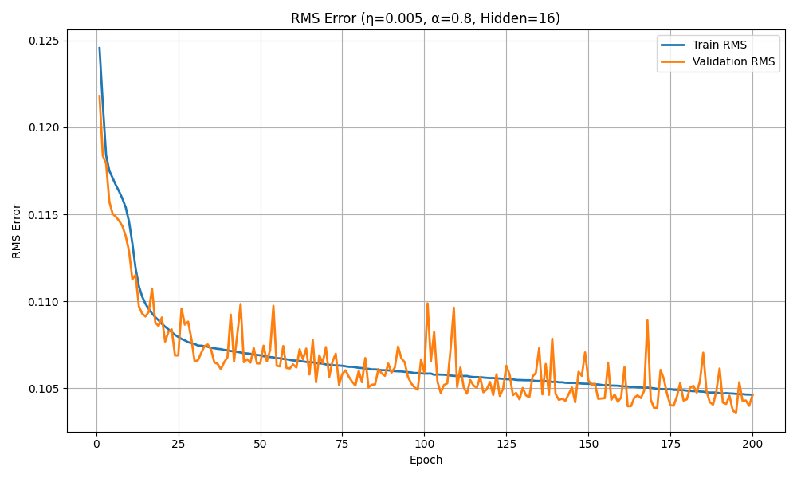

# Neural-Rocket-Lander

A rocket landing simulation where a neural network controller — trained from human demonstration data — learns to pilot a rocket to the landing pad. The ML component is implemented **from scratch in Python** using object-oriented design, with no deep learning frameworks.

> **Collaboration note:** The game engine and simulation loop were built by [Lewis Veryard](https://github.com/lewisveryard) and [Hugo Leon-Garza](https://github.com/hugoleongarza). The neural network controller (everything in `MLP/` and `NeuralNetHolder.py`) was designed and implemented independently.

---

## What It Does

A human plays the rocket lander game to generate demonstration data — positional states paired with the velocity actions taken. The MLP then learns this state-to-action mapping via **behavioural cloning**:

```
Inputs:  (x, y)         — normalised rocket position
Outputs: (v_x, v_y)     — commanded velocity
```

At inference time, the trained controller replaces the human player, autonomously guiding the rocket using learned velocity commands.

---

## Neural Network Architecture

Built entirely from scratch using OOP — no PyTorch, no TensorFlow.

| Component         | Detail                              |
|-------------------|-------------------------------------|
| Architecture      | Fully-connected feedforward MLP     |
| Inputs / Outputs  | 2 → 2                               |
| Hidden neurons    | 16                                  |
| Activation        | Sigmoid (hidden), Linear (output)   |
| Learning rule     | Backpropagation with momentum       |
| Optimiser         | Online (stochastic) gradient descent|

**Key implementation features:**
- Layer, Neuron, Network classes with clean separation of concerns
- Forward and backward pass implemented manually
- Momentum term (α) on weight updates to smooth convergence
- Early stopping based on validation plateau (patience = 20 epochs)
- Best-weights restoration: saves snapshot at lowest validation RMS, restores at end of training
- Grid search over η, α, and hidden neuron count with logging to CSV

---

## Training Results

Hyperparameter search over learning rate (η), momentum (α), and hidden layer size. Best configuration found:

| Hyperparameter    | Value   |
|-------------------|---------|
| Learning rate (η) | 0.005   |
| Momentum (α)      | 0.8     |
| Hidden neurons    | 16      |
| Best epoch        | 195     |

| Metric              | Value  |
|---------------------|--------|
| Validation RMS      | 0.1035 |
| Test RMS            | 0.1036 |

*RMS errors are on normalised data (min-max scaled inputs and outputs).*

The near-identical validation and test RMS indicates the model generalises well with no overfitting.

**Training curve:**



The train and validation curves track closely throughout, converging from ~0.125 to ~0.104 RMS over 200 epochs.

---

## Project Structure

```
Neural-Rocket-Lander/
│
├── MLP/
│   ├── network.py          # Network class — forward/backward pass, train/validate/test
│   ├── layer.py            # Layer class — vectorised forward, delta computation, weight update
│   ├── neuron.py           # Neuron class — weights, bias, delta, momentum state
│   ├── activationfunctions.py  # Sigmoid and Linear activation functions
│   ├── DataProcessor.py    # Data loading, normalisation, train/val/test split
│   ├── util.py             # Training loop, early stopping, hyperparameter search, export
│   └── applications.py     # Grid search orchestration, plotting, CSV logging
│
├── NeuralNetHolder.py      # Inference wrapper — loads trained weights and runs predictions
├── GameLoop.py             # Game simulation loop (Lewis Veryard, Hugo Leon-Garza)
├── Files/                  # Game config and assets
├── trained_weights.csv     # Saved weights from best model
├── best_parameters.json    # Best hyperparameters from grid search
├── scaling_values.json     # Min-max scaling values for normalisation
└── Main.py                 # Entry point
```

---

## Getting Started

**Requirements:** Python 3.8+, NumPy, Pandas, Matplotlib
(Must run on Windows for the game to load)

```bash
git clone https://github.com/AlyKhalil/Neural-Rocket-Lander.git
cd Neural-Rocket-Lander
pip install numpy pandas matplotlib pygame
```

**Run the game (human or AI controller):**
```bash
python Main.py
```

**Re-run hyperparameter search and retrain:**
```python
from MLP.util import hyperparameter_search
hyperparameter_search(
    hidden_neurons=[8, 16, 32],
    etas=[0.1, 0.01, 0.005],
    alphas=[0.5, 0.8, 0.9],
    epochs=300
)
```

Trained weights are saved automatically to `trained_weights.csv` and `best_parameters.json`.

---

## Skills Demonstrated

- Neural network implementation from scratch (backpropagation, momentum SGD)
- Behavioural cloning / imitation learning
- Hyperparameter optimisation with early stopping and best-weights restoration
- Object-oriented design in Python
- Train / validation / test methodology with proper generalisation checking
